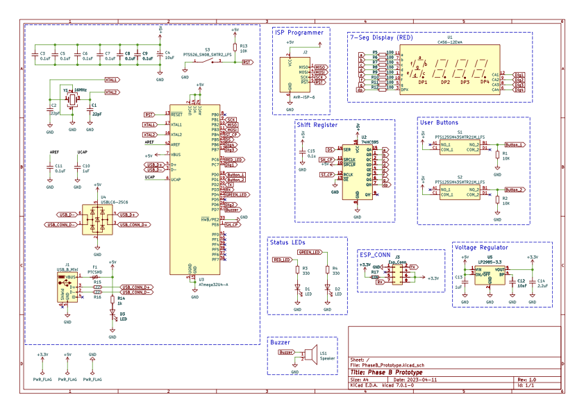
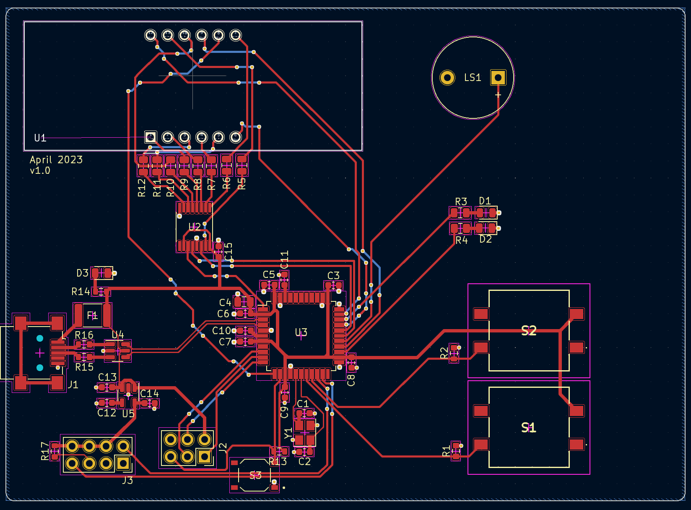
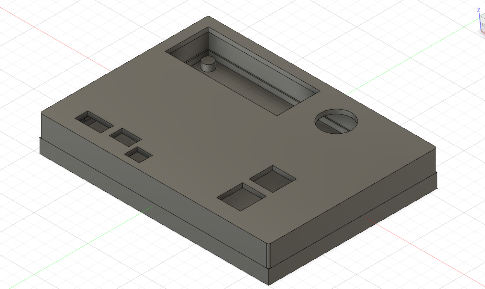

# Project Requirements

The requirements for this project are fairly simple. We need a timer that can display up to one hour and must keep the time accurately. There are three user buttons, two indicator LEDs, and a buzzer that goes off when the time is up. One user button will increase the time, one button will toggle whether the timer is running or not, and one button will reset it. Additionally, the timer must be able to be communicated with over WiFi. A user should be able to start, stop, and check the timer by connecting to it via WiFi, without having to physically interact with the device.

# System Design

<object data="./Hardware_Block_Diagram.pdf" type="application/pdf">
      
Unable to display PDF file. <a href="./Code_Block_Diagram.pdf">Download</a> instead.

</object>

# Component Selection

The ATmega32U4 was a good choice for the processor because it is in the same family of processors that was used in the original prototype, which means it will be easier to swap in this processor without making many changes. This package is SMD so it can be placed directly onto the PCB. The crystal was chosen to be 16MHz. The resistors, capacitors, and LEDs were all chosen in the 0603 and 0805 SMD packages to reduce their footprints on the PCB. A resettable fuse is used with the USB for protection and so it doesn’t need to be replaced.

|Mfr. #|Manufacturer|Description|
|---|---|---|
|ATMEGA32U4-AU|Microchip|8-bit Microcontrollers - MCU AVR USB 32K FLASH INDUSTRIAL|
|MF-MSMF050-2|Bourns|Resettable Fuses - PPTC 15V .5A-HD 100A MAX|
|LP2985-33DBVR|Texas Instruments|LDO Voltage Regulators 150-mA Low-Noise 1.5% tolerance|
|ABM8-16.000MHZ-D1X-T|ABRACON|Crystals CRYSTAL 16.0000MHZ 18PF SMD|

# Build Prototype

A prototype for this board was produced in Phase A, except an Arduino Shield was providing the microprocessor and there was no ESP WiFi module. Most other features on this board (LEDs, buttons, shift register, 7-segment-diplay) were also present on the prototype and should function the same. Since we are using the same family of microprocessors, most of the codebase should still function on the new build. With the prototype, the timer was able to function as intended with the user interface and display. In this version, the addition of the ESP WiFi module and moving the processor onto the board will change how we communicate with the board.

# PCB Design

There is filtering for the input voltage. A reset button connects directly to the microprocessor. The 7 segments display connects to a shift register which itself connects to the microprocessor. The LEDs, user buttons, and buzzer all connect directly to the microprocessor’s GPIO pins. Some pins were also broken out to connect the ESP WiFi module to. An ISP programmer is also attached to some broken out pins for programming.

The microprocessor is centrally located on the board, with the capacitors as close as possible to the 5V pins. The crystal is also located close to the microprocessor. There is a ground plain which all the ground pins are connected to with vias located as close to the pins as possible. The USB pairs have been routed differentially.

# Assemble Stage

In order to assemble the board I hand soldered the components to the board. Unfortunately after soldering, we were unable to load the firmware onto the board. The computer recognized it as a USB device when plugged in, but was unable to communicate with the microprocessor. As this was my first time soldering, it is possible that I might have damaged the processor while soldering it to the board. We checked for cold joints but the board was still unresponsive. Further debugging must be done to determine the reason for the boards unresponsiveness.

# Software Development

The code is formatted with the Mutex – Embedded C Style guidelines. It uses interrupts and flags to achieve concurrency. Three timers are used: Timer 1 keeps track of seconds, Timer 2 controls the rate of the 7-segment display, and Timer 3 controls the rate of the serial read. There is also a start/stop button as well as an increment button. The buttons are attached to interrupts which perform their function within the ISRs.

<object data="./Code_Block_Diagram.pdf" type="application/pdf">
      
Unable to display PDF file. <a href="./Code_Block_Diagram.pdf">Download</a> instead.

</object>

# Enclosure Design

The enclosure is straightforward. It is a simple box to enclose the PCB, with cutouts for the 7-segment display, buzzer, buttons, ESP connector, and ISP programmer. There is also a lip of the inside of the two halves to keep them together. Since there are no screw holes in the PCB, there are solid pillars inside the boxes to sandwich the PCB to keep it from moving.

